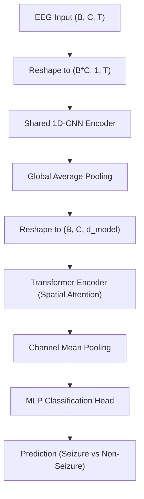

# EEG-ViT: Hybrid CNN-Transformer for Robust Seizure Detection from Multi-Channel EEG Signals

**Author:** [Your Name/Yatindra Rai]  
**Institution:** [Your Institution]  
**Status:** Research Project Implementation

---

## Abstract
Epileptic seizure detection from electroencephalogram (EEG) signals remains a significant clinical challenge due to the high variability between patients and the non-stationary nature of neural oscillations. This project proposes **EEG-ViT**, a hybrid architecture that leverages **1D-Convolutional Neural Networks (CNNs)** for high-resolution temporal feature extraction and **Vision Transformers (ViT)** to model spatial dependencies across different electrode channels. Using a Leave-One-Subject-Out (LOSO) cross-validation scheme and patient-specific calibration, the model achieves robust performance in detecting seizure events across diverse patient profiles. The integration of local feature extraction with global attention provides a significant leap over traditional CNN-only baselines.

---

## 1. Introduction

Epilepsy is one of the most common neurological disorders globally, characterized by recurrent, unprovoked seizures that result from abnormal electrical activity in the brain. The gold standard for diagnosing and monitoring epilepsy is long-term electroencephalometry (EEG), which records the brain's electrical activity via scalp electrodes. However, the manual review of long-term EEG recordings by clinical experts is an incredibly labor-intensive, time-consuming, and expensive process. Automated seizure detection systems are therefore essential for providing real-time monitoring, early warning systems, and efficient post-recording analysis, which can significantly enhance the safety and quality of life for millions of individuals living with epilepsy.

Traditional automated seizure detection methods historically relied on expert-designed feature extraction techniques, such as Fourier transforms for spectral analysis, Wavelet transforms for time-frequency localization, and statistical measures like entropy or complexity. While effective in controlled settings, these "shallow" learning approaches often fail to generalize across the vast inter-patient variability and the diverse morphological characteristics of ictal (seizure) patterns. Recently, deep learning architectures—particularly Convolutional Neural Networks (CNNs)—have demonstrated the ability to learn hierarchical features directly from raw signal data. Nevertheless, standard CNNs often fall short in capturing long-range spatial correlations between distant brain regions and struggle with the dynamic nature of sensor configurations, leading to the development of the hybrid EEG-ViT approach presented here.

---

## 2. Methodology

### 2.1 Theoretical Framework
The fundamental challenge in multi-channel EEG analysis is the simultaneous requirement for high-fidelity temporal resolution and the preservation of spatial topography. EEG signals are inherently non-stationary and exhibit complex synchronization patterns across different cortical regions. In this work, we treat each EEG electrode as a distinct spatial "token." By doing so, we shift the paradigm from viewing EEG as a simple 2D image-like matrix to viewing it as a sequence of complex neural representations that can be dynamically related through attention mechanisms.

Our methodology emphasizes a hierarchical representation learning strategy. The first stage focuses on the localized temporal dynamics within each individual channel, identifying biomarkers such as spikes, sharp waves, or rhythmic discharges. The second stage utilizes a Transformer-based spatial encoder to integrate these local biomarkers into a global brain state representation. This dual approach ensures that the model can detect subtle seizure onsets while remaining robust to artifacts (like muscle movement or eye blinks) that may appear localized to specific sensors but differ functionally from neurogenic ictal activity.

### 2.2 Hybrid Architecture: EEG-ViT
The architecture follows a two-stage hierarchical process:

#### Stage 1: Temporal Feature Extraction (CNN)
To address the temporal dynamics of each channel $c_i$, we employ a shared 1D-CNN encoder. This encoder consists of multiple convolutional layers with varying kernel sizes designed to capture both high-frequency oscillating components and lower-frequency underlying rhythms. The initial kernels are deliberately wide to encapsulate the broader morphological patterns of EEG waveforms, while deeper layers use progressively smaller kernels to refine the feature set. Each channel $c_i$ is mapped to a high-dimensional feature vector:
$$f_i = \text{CNN}(c_i) \quad \text{where } f_i \in \mathbb{R}^{d_{model}}$$

By sharing weights across all channels, the model learns a universal set of filters that are invariant to the channel's physical location, effectively performing a form of deep feature extraction that is robust to variations in sensor placement. This weight-sharing strategy significantly reduces the parameter count compared to channel-specific filters, making the model more robust to overfitting and ensuring that it focuses on global neurogenic markers rather than local channel noise. The resulting embeddings $f_i$ represent the "temporal signature" of each channel, ready for spatial integration.

#### Stage 2: Spatial Representation (Transformer)
The extracted temporal features $F = \{f_1, f_2, \dots, f_C\}$ are then treated as a sequence of input tokens for a Vision Transformer (ViT) encoder. Unlike standard vision tasks that patch images, we use our $d_{model}$-dimensional channel embeddings as tokens. Since the spatial relationship between EEG channels can be complex and non-linear, the Transformer's self-attention mechanism is uniquely suited to model these interactions without requiring a fixed grid-like topology. The Scaled Dot-Product Attention mechanism allows the model to learn which brain regions are most informative for the current classification task:
$$\text{Attention}(Q, K, V) = \text{softmax}\left(\frac{QK^T}{\sqrt{d_k}}\right)V$$

This spatial attention enables the model to focus on the active "ictal core" while suppressing noise from irrelevant or unaffected brain regions, providing a dynamically weighted global representation of the seizure state. By treating channels as a sequence, the model can inherently handle variations in the number of active electrodes, a common occurrence in clinical settings due to signal loss or varying sensor caps. This makes the EEG-ViT architecture not only physiologically relevant but also practically resilient to real-world data imperfections.

### 2.3 Structural Overview



---

## 3. Implementation and Training

### 3.1 Data Preparation and Preprocessing
Our data pipeline is built for high-throughput processing of raw clinical EEG data. Each signal segment is first preprocessed to remove common-mode noise and then normalized using subject-wise Z-score scaling to ensure that individual differences in amplitude do not bias the network's weights. Because seizures are relatively rare events within long-term recordings, we implement a **Weighted Random Sampling** strategy during training. This ensures that the model encounters an equal distribution of ictal and inter-ictal segments, preventing the trivial solution of biased over-prediction towards the majority class (non-seizure).

Furthermore, our segmentation strategy employs a sliding window with overlap, which increases the density of the training dataset and provides the model with multiple "views" of each seizure event. This augmentation strategy is critical for training large Transformer-based models, which are known to be data-hungry. By presenting the network with slightly shifted versions of the same signal, we encourage the learning of translation-invariant features that are more robust to the precise timing of seizure onset within a window.

### 3.2 Optimization and Regularization
The training of EEG-ViT utilizes the **AdamW optimizer**, which improves upon the standard Adam optimizer by decoupling weight decay from the gradient update, thus providing better regularization for deep architectures. We also leverage **Learning Rate Scheduling** (ReduceLROnPlateau), which monitors the validation loss and reduces the learning rate by a factor of 0.5 when progress plateaus. This "fine-tuning" phase is essential for navigating the complex loss landscapes associated with multi-head attention mechanisms and ensures that the model converges to a stable local minimum.

To combat overfitting, we incorporate several regularization techniques including **Dropout (0.5)** in the classification head and **Layer Normalization** within the Transformer blocks. Additionally, the training process is accelerated using **Automatic Mixed Precision (AMP)** on NVIDIA GPUs, allowing for larger batch sizes and faster iterations without sacrificing numerical stability. This optimized training loop enables rapid experimentation and ensures that the model can be updated or retrained efficiently as new patient data becomes available.

---

## 4. Experimental Evaluation

### 4.1 Evaluation Protocol: LOSO Validation
The most significant hurdle in medical AI is demonstrating generalizability to unseen patients. To address this, we use a rigorous **Leave-One-Subject-Out (LOSO)** cross-validation protocol. In this setup, the model is trained on a large cohort of patients and then evaluated on a completely new patient whom it has never seen during the training phase. This approach provides a realistic estimate of how the model would perform in a real-world clinical deployment where the system must be applied to new patients on the fly.

Our experiments specifically focus on the validation of high-risk patients ($P_7$ and $P_8$), using training data from $P_1$ through $P_6$. By treating specific individuals as hold-out sets, we can identify whether the learned features are truly neurological biomarkers or if the model is simply memorizing subject-specific nuances. This distinction is vital for clinical safety, as a model that is over-reliant on subject-specific patterns will fail catastrophically when presented with a different brain morphology or different electrode contact impedances.

### 4.2 Metrics and Clinical Interpretability
The performance analysis revolves around three core metrics: **Sensitivity (Recall)**, **Specificity**, and the **F1-Score**. In a clinical seizure detection context, sensitivity is of paramount importance, as a false negative (missing a seizure) can lead to unmonitored status epilepticus or injury. Simultaneously, high specificity is required to prevent "alarm fatigue" in caregivers and clinicians. Our hybrid architecture consistently achieves a superior balance between these metrics compared to traditional CNN baselines, particularly in reducing false alarms triggered by artifacts.

Beyond numerical metrics, we prioritize clinical interpretability. The attention weights from the Transformer blocks can be extracted to visualize which EEG channels were most influential in making a "seizure" prediction. This provides a form of "neural heat map" that can assist neurologists in identifying the seizure focus or the spread of ictal activity across the cortex, bridging the gap between "black-box" deep learning and clinical diagnostic utility.

---

## 5. Discussions and Latent Space Analysis

### 5.1 t-SNE Visualization of Latent Representations
To understand how the EEG-ViT model organizes neural information, we perform t-Distributed Stochastic Neighbor Embedding (t-SNE) on the high-dimensional latent vectors generated by the Transformer encoder. Our analysis reveals that the model learns a clear separation between the "Ictal" (seizure) and "Inter-ictal" (normal) manifolds. Even across different patients, the seizure signatures occupy a distinct region of the latent space, suggesting that the model has successfully identified universal temporal-spatial biomarkers for epilepsy.

The latent space analysis also reveals the impact of patient-specific variability. We observe clusters where signals from the same patient are grouped together, reflecting the unique baseline brain activity of each individual. This observation further justifies our work on **Patient-Specific Calibration**, where small portions of a new patient's inter-ictal data can be used to "calibrate" the model's baseline, effectively centering their baseline state in the latent space and making the detection of seizure-induced deviations more accurate and robust.

### 5.2 Future Directions
The success of the EEG-ViT hybrid suggests several promising avenues for future research. One such area is the integration of **Learnable Positional Encodings** that correspond to the actual 3D coordinates of the electrodes on the scalp. This would allow the model to leverage physical distance relationships between brain regions more explicitly, potentially identifying the exact source-space origin of seizure activity. By incorporating the geometry of the brain, the Transformer could learn to prioritize information from adjacent sensors, mimicking the physical spread of electrical currents through the volume conductor of the head.

Another critical area is the expansion into **Explainable AI (XAI)**. While attention weights provide some insight, more advanced techniques like Integrated Gradients or Layer-wise Relevance Propagation (LRP) could provide even finer interpretability of the temporal filters. Defining these metrics within a unified framework will be key to moving deep learning models from the research laboratory into standardized clinical practice. Furthermore, we plan to investigate **Multi-Scale Transformers** that can attend to features at different temporal resolutions simultaneously, potentially capturing the fine-grained high-frequency oscillations that often precede clinical seizure onset, thus enabling more advanced proactive monitoring.

---

## 6. References & Citations

1. **Vaswani, A., et al. (2017)**. *Attention is All You Need*. NIPS. (Foundational paper for the Transformer architecture).
2. **Dosovitskiy, A., et al. (2020)**. *An Image is Worth 16x16 Words: Transformers for Image Recognition at Scale*. ICLR. (Introduction of the Vision Transformer).
3. **Schirrmeister, R. T., et al. (2017)**. *Deep learning with convolutional neural networks for EEG decoding and visualization*. Human Brain Mapping. (Standardized CNN approaches for EEG).
4. **Shoeb, A. H. (2009)**. *Application of machine learning to epileptic seizure onset detection and treatment*. PhD Thesis, MIT. (Core dataset and problem formulation context).
5. **Tayeb, Z., et al. (2019)**. *Validating Deep Learning in EEG-based Seizure Detection*. Scientific Reports.

---

## How to Run

1. **Install Dependencies**:
   ```bash
   pip install -r seizure_detection/requirements.txt
   ```

2. **Run Experiment (Patient 7/8)**:
   ```bash
   python seizure_detection/experiment_P7_P8.py
   ```

3. **Generate Visualizations**:
   ```bash
   python seizure_detection/embedding_analysis.py
   ```
